# 🛡️ Conception et Implémentation d'une Infrastructure Réseau Sécurisée sur Azure

## 🎯 Objectif du Projet

Ce projet a pour objectif de concevoir et déployer une infrastructure réseau sécurisée et évolutive sur Microsoft Azure, simulant un environnement cloud d’entreprise. Il s’inscrit dans une démarche d’apprentissage avancé des pratiques de sécurité réseau, de segmentation, de connectivité hybride, de supervision et de résilience, dans le contexte des architectures cloud modernes.

L’ensemble des composants déployés vise à reproduire un scénario réaliste, incluant des sous-réseaux logiques (web, applicatif, base de données, administration), un accès distant sécurisé, un routage adapté, et une gestion fine des flux réseau.

## 🗺️ Aperçu de l'Architecture

L’infrastructure conçue repose sur les éléments suivants :

- Un **réseau virtuel Azure (VNet)** avec une segmentation en quatre sous-réseaux principaux: `web-subnet`, `app-subnet`, `db-subnet`, `mgmt-subnet`.  
- Un schéma d’**adressage IP CIDR bien défini** pour chaque sous-réseau.  
- Le **déploiement de machines virtuelles** dans chaque sous-réseau, jouant les rôles suivants : serveur web, application, base de données et machine d’administration.  
- Un **accès distant sécurisé via Azure Bastion** pour l’administration sans exposition directe des ports RDP/SSH.  
- Des **Groupes de Sécurité Réseau (NSG)** appliqués à chaque sous-réseau pour contrôler les flux réseau.  
- Une configuration **DNS personnalisée ou via Azure DNS interne** pour permettre la résolution des noms entre les VMs.  
- Une **connectivité hybride simulée via VPN Point-to-Site (P2S)** entre un client local et l’infrastructure cloud.  
- L’**activation de Network Watcher** et des **journaux de flux NSG** pour superviser et analyser le trafic réseau.

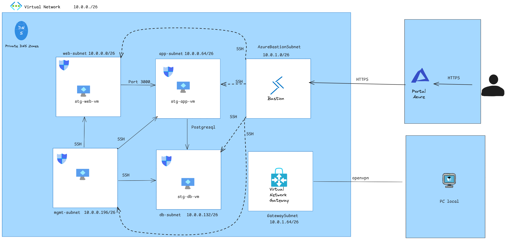

> **Figure 0.1 – Architecture du réseau.**

---

# 1. Mise en Place de la Structure Réseau Virtuelle

La première étape de la construction de notre infrastructure cloud sur Azure consiste à définir le réseau virtuel principal (VNet) et à le segmenter en plusieurs sous-réseaux (subnets) correspondant aux différentes couches fonctionnelles de l’architecture.

## 📐 Plan d’Adressage IP

L’espace d’adressage global choisi pour le VNet est `10.0.0.0/23`, offrant 512 adresses IP. Cet espace a été divisé en **huit sous-réseaux** de taille /26 (64 adresses chacun), assurant une bonne séparation des services tout en gardant de la flexibilité pour des extensions futures.

| Nom du Sous-Réseau   | Plage CIDR     | Nb d’adresses | 1ère adresse utilisable | Dernière adresse utilisable | Adresse de broadcast | Rôle prévu                         |
|----------------------|----------------|----------------|--------------------------|-----------------------------|-----------------------|------------------------------------|
| web-subnet            | 10.0.0.0/26    | 64             | 10.0.0.4                 | 10.0.0.62                   | 10.0.0.63             | Hébergement des serveurs web       |
| app-subnet            | 10.0.0.64/26   | 64             | 10.0.0.68                | 10.0.0.126                  | 10.0.0.127            | Couches applicatives               |
| db-subnet             | 10.0.0.128/26  | 64             | 10.0.0.132               | 10.0.0.190                  | 10.0.0.191            | Serveurs de base de données        |
| mgmt-subnet           | 10.0.0.192/26  | 64             | 10.0.0.196               | 10.0.0.254                  | 10.0.0.255            | Accès administratif                |
| AzureBastionSubnet   | 10.0.1.0/26    | 64             | 10.0.1.4                 | 10.0.1.62                   | 10.0.1.63             | Déploiement d'Azure Bastion        |
| GatewaySubnet        | 10.0.1.64/26   | 64             | 10.0.1.68                | 10.0.1.126                  | 10.0.1.127            | Connexion VPN Point-to-Site (P2S)  |
| ReservedSubnet1      | 10.0.1.128/26  | 64             | 10.0.1.132               | 10.0.1.190                  | 10.0.1.191            | Réservé pour évolution future      |
| ReservedSubnet2      | 10.0.1.192/26  | 64             | 10.0.1.196               | 10.0.1.254                  | 10.0.1.255            | Réservé pour évolution future      |

🔎 *Pour l’instant, seuls les six premiers sous-réseaux sont utilisés.*

> ℹ️ **Remarque importante** : bien que chaque plage CIDR définisse une adresse de broadcast, **Azure ne l’utilise pas** dans le sens classique des réseaux traditionnels. En revanche, **5 adresses sont toujours réservées par Azure** dans chaque sous-réseau. Par exemple dans **web-subnet** on a :
> - `.0` → Adresse réseau  
> - `.1` à `.3` → Réservées pour les services internes Azure  
> - `.63` → Inutilisable par les VMs
> 
> ✅ Cela signifie que pour un subnet en `/26`, **59 adresses IP sont réellement disponibles pour les machines virtuelles.**

## 🧱 Objectif de la Segmentation

Ce découpage permet :

- une **isolation stricte des flux** entre les différentes zones fonctionnelles,
- une **application de politiques NSG ciblées**,
- une **meilleure sécurité réseau** et une architecture scalable,
- la possibilité d’**ajouter de nouveaux services** sans reconfigurer l’ensemble.

## 🖼️ Capture d’Écran

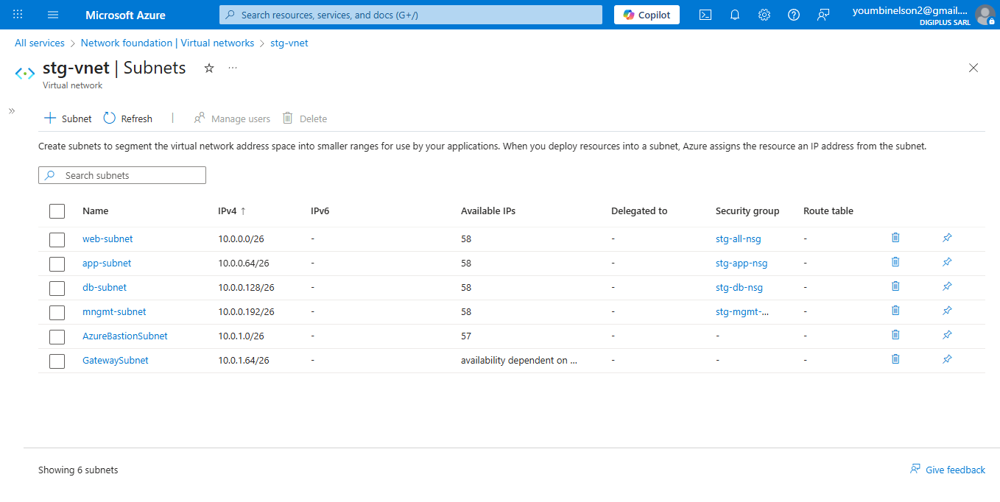

> **Figure 1.1 – Liste des sous réseaux déployées dans le portail Azure.**

---

# 2. Déploiement des Machines Virtuelles (VMs)

Après avoir structuré notre réseau virtuel et ses sous-réseaux, la seconde étape consiste à y déployer les premières machines virtuelles (VMs) pour simuler les composants essentiels d’un environnement cloud d’entreprise.

## 🧩 Présentation des VMs Déployées

Quatre machines virtuelles ont été créées, chacune rattachée à un sous-réseau spécifique selon son rôle :

- Une VM **web** dans `web-subnet` pour simuler un serveur web.
- Une VM **applicative** dans `app-subnet` pour héberger la logique métier.
- Une VM **base de données** dans `db-subnet` (sans déploiement effectif de base de données).
- Une VM **administrative** dans `mgmt-subnet` pour la gestion et la supervision.

L'authentification est configurée par **mot de passe**, avec des paramètres standards pour un usage en environnement de test.

## 📋 Tableau Récapitulatif

| Nom de la VM     | Sous-réseau       | Adresse IP privée  | OS utilisé          |
|------------------|-------------------|--------------------|---------------------|
| stg-web-vm       | web-subnet        | 10.0.0.4           | Ubuntu Server 20.04 |
| stg-app-vm       | app-subnet        | 10.0.0.68          | Ubuntu Server 20.04 |
| stg-db-vm        | db-subnet         | 10.0.0.132         | Ubuntu Server 20.04 |
| stg-mgmt-vm      | mgmt-subnet       | 10.0.0.196         | Ubuntu Server 20.04 |

> ℹ️ *Les adresses IP ont été choisies automatiquement dans chaque plage disponible par Azure.*

## 🖼️ Capture d’Écran

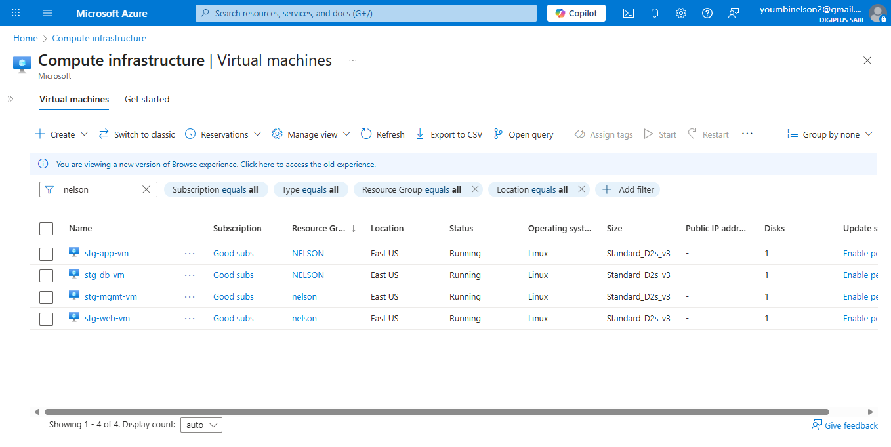

> **Figure 2.1 – Liste des machines virtuelles déployées dans le portail Azure.**

---

# 3. Déploiement d’Azure Bastion

Dans un souci de sécurité, l’accès aux machines virtuelles n’est **pas exposé via des IP publiques** ni via RDP/SSH directs. Pour garantir un accès sécurisé et sans ouvrir de ports sur Internet, nous avons déployé **Azure Bastion**.

## 🔐 Pourquoi Azure Bastion ?

Azure Bastion permet :

- d'établir une session **SSH ou RDP via le portail Azure**, sans adresse IP publique,
- de **réduire la surface d’attaque**, en évitant d’exposer les ports 22 et 3389,
- d’avoir une **expérience utilisateur fluide et sécurisée** dans la console.

## 🧭 Configuration réalisée

Le service Bastion a été associé à un sous-réseau spécifique nommé `AzureBastionSubnet`, conformément aux exigences d’Azure (nom obligatoire pour son bon fonctionnement).

| Élément                    | Détail                                |
|----------------------------|---------------------------------------|
| Nom du Bastion             | stg-bastion                           |
| Sous-réseau associé        | AzureBastionSubnet (`10.0.1.0/26`)    |
| Région                     | EAST US                               |
| Méthode d’authentification | Par mot de passe uniquement           |
| Intégration                | Connecté au VNet principal `stg-vnet` |

> ✅ Bastion permet d’accéder directement à toutes les VMs via le portail sans modifier leurs règles NSG.

## 🖼️ Capture d’Écran

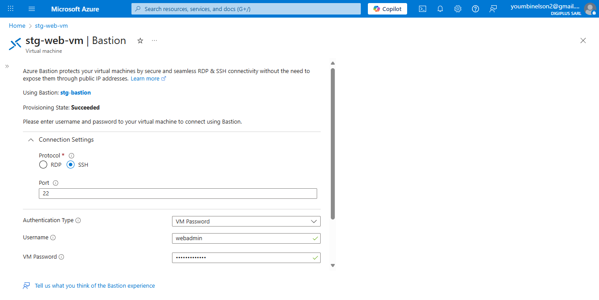

> **Figure 3.1 – Connexion sécurisée via Azure Bastion.**

---

# 4. Mise en place des Groupes de Sécurité Réseau (NSG)

Pour assurer un **contrôle rigoureux du trafic réseau**, chaque sous-réseau de l'infrastructure a été protégé par un **Groupe de Sécurité Réseau (NSG)** dédié. Ces NSG permettent d’autoriser ou de bloquer des connexions entrantes et sortantes selon des critères bien définis.

## 🔐 Objectifs des NSG

Les NSG ont pour but de :

- Restreindre l’accès aux machines virtuelles,
- Limiter les flux réseau à ce qui est **strictement nécessaire**,
- Séparer les **niveaux fonctionnels** de l’architecture (Web / App / DB / Admin),
- Réduire les **risques d’attaque latérale**.

## 🧭 NSG créés et associations

| Nom du NSG     | Sous-réseau associé |
|----------------|---------------------|
| stg-web-nsg    | stg-web-subnet      |
| stg-app-nsg    | stg-app-subnet      |
| stg-db-nsg     | stg-db-subnet       |
| stg-mgmt-nsg   | stg-mgmt-subnet     |

## ⚙️ Règles configurées

### 🔸 stg-web-nsg

- Autorise le **trafic HTTP (80)** et **HTTPS (443)** depuis Internet.
- Autorise **SSH (22)** uniquement depuis :
  - `stg-mgmt-subnet`
  - `AzureBastionSubnet`
- Bloque toutes les autres tentatives SSH.

  
> **Figure 4.1 – Règles configurées pour le NSG du sous-réseau Web.**

### 🔸 stg-app-nsg

- Autorise uniquement :
  - le port **3000** depuis `stg-web-subnet` (`10.0.0.0/26`),
  - le port **22 (SSH)** depuis `stg-mgmt-subnet` et `AzureBastionSubnet`.
- Bloque tout autre accès à ces ports.

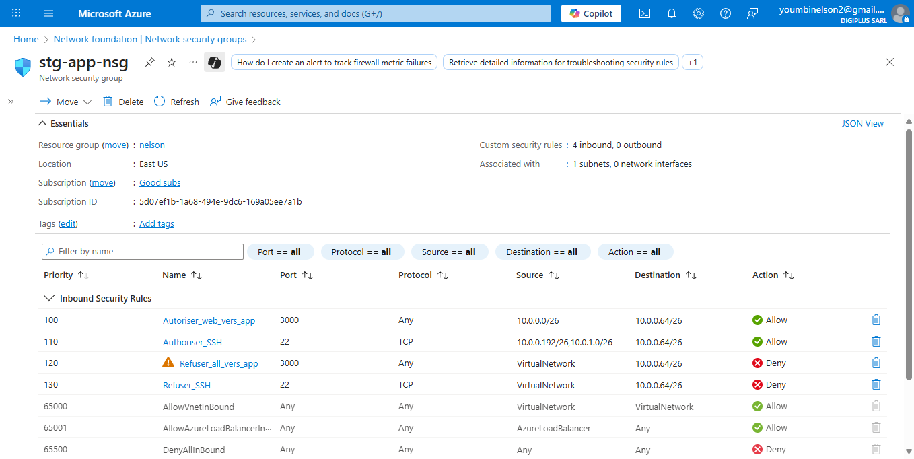  
> **Figure 4.2 – Règles configurées pour le NSG du sous-réseau Applicatif.**

### 🔸 stg-db-nsg

- Autorise uniquement :
  - le port **5432 (PostgreSQL)** depuis `stg-app-subnet` (`10.0.0.64/26`),
  - le port **22 (SSH)** depuis `stg-mgmt-subnet` et `AzureBastionSubnet`.
- Bloque toutes les autres connexions entrantes.

  
> **Figure 4.3 – Règles configurées pour le NSG du sous-réseau Base de Données.**

### 🔸 stg-mgmt-nsg

- Autorise uniquement **SSH (port 22)** depuis le sous-réseau Bastion (`10.0.1.0/26`).
- Toutes les autres connexions SSH sont interdites.

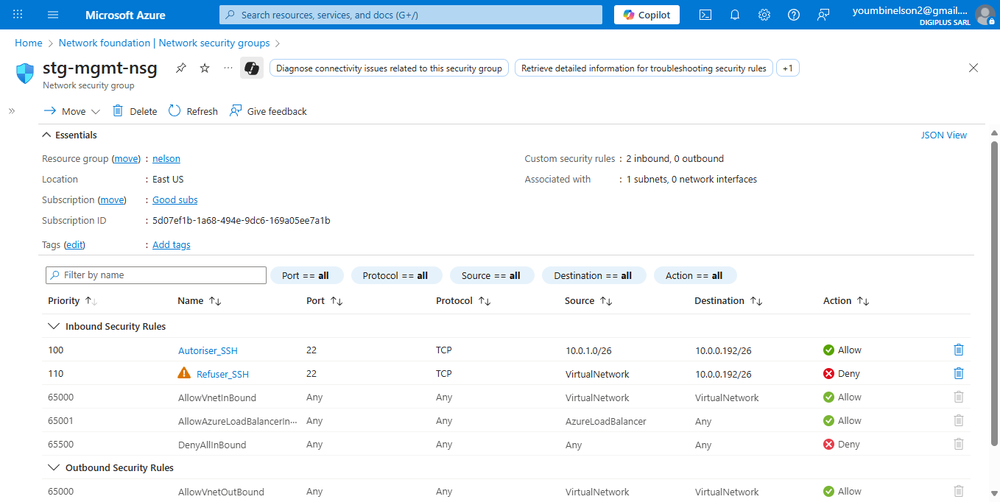  
> **Figure 4.4 – Règles configurées pour le NSG du sous-réseau de gestion.**

### 🔸 Vue d’ensemble

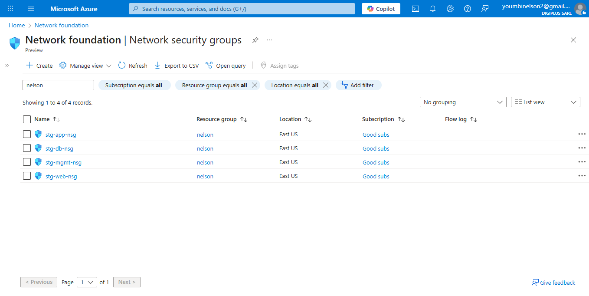  
> **Figure 4.5 – Synthèse visuelle des NSG déployés dans l’environnement Azure.**

---

# 5. Configuration du DNS Privé Azure

Pour permettre une résolution de noms interne entre les machines virtuelles, une **zone DNS privée Azure** nommée `stg.local` a été créée. Elle permet de gérer les enregistrements DNS sans exposer de serveur DNS classique, et sans utiliser d’adresses IP directement.

## 🧭 Configuration réalisée

Une zone DNS privée `stg.local` a été créée dans le portail Azure. Les enregistrements DNS ont été ajoutés manuellement, avec un nom pour chaque machine virtuelle du projet :

- `web.stg.local`
- `app.stg.local`
- `db.stg.local`
- `mgmt.stg.local`

> Cette configuration permet d'utiliser des noms DNS lisibles et stables plutôt que des IPs, facilitant la communication entre services internes.

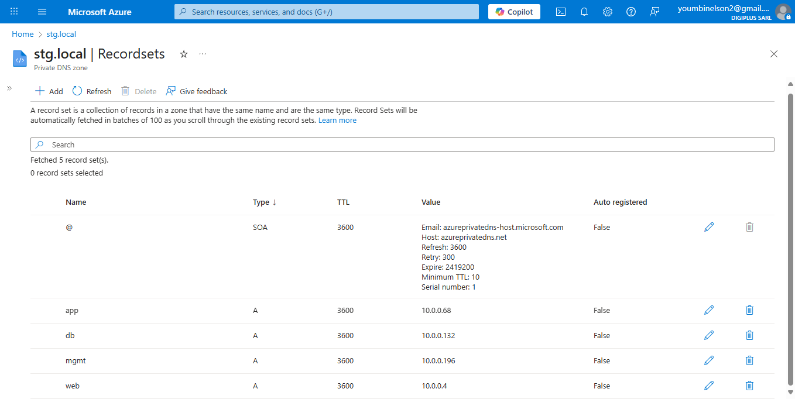  
> **Figure 5.1 – Enregistrements définis dans la zone DNS privée `stg.local`.**

## ✅ Résultat de la résolution de noms

Des tests de résolution ont été effectués à l’aide de la commande `ping` entre les machines. Les noms DNS définis ont bien été résolus automatiquement, confirmant la bonne association entre la zone privée et le réseau virtuel.

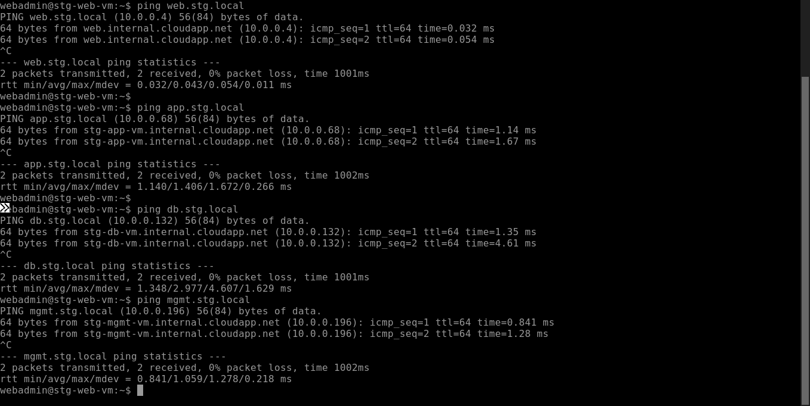  
> **Figure 5.2 – Résolution des noms depuis la VM web.**

---

# 6. Mise en place du VPN Point-to-Site (P2S)

Le VPN Point-to-Site (P2S) permet de connecter de manière sécurisée un poste distant (comme un ordinateur personnel) au réseau virtuel Azure. Ce type de VPN est particulièrement utile pour les administrateurs, développeurs ou ingénieurs en télétravail qui ont besoin d'accéder aux ressources internes d'un environnement cloud sans exposer celles-ci à Internet.

## 🔐 Principe du VPN P2S

Le fonctionnement repose sur une architecture **client-serveur** :

- **Azure agit comme serveur VPN**, via une passerelle disposant d'une IP publique.
- **Le client VPN** (OpenVPN) est installé localement sur le poste distant.
- La connexion est chiffrée et authentifiée par **certificats** auto-signés.
- Aucune adresse IP publique n’est exposée sur les machines virtuelles.

Ce type de connexion est adapté pour des **accès individuels, temporaires et sécurisés**, comme la maintenance à distance ou la supervision réseau.

## 🔑 Génération des certificats

La génération des certificats s’est faite **en local** via PowerShell :

1. Création d’un **certificat racine auto-signé**.
2. Génération d’un **certificat client** signé avec le certificat racine.
3. Exportation du certificat client au format `.pfx` (protégé par mot de passe).
4. Importation du certificat racine (en Base64) dans Azure.

Cela garantit que seuls les postes disposant d’un certificat client valide peuvent établir une connexion.

## 🔧 Configuration de la passerelle VPN Azure

Une passerelle VPN a été déployée dans le réseau virtuel Azure, plus précisément dans un sous-réseau réservé nommé `GatewaySubnet`.

### Paramètres choisis :
- **Type de passerelle** : VPN
- **Protocole** : OpenVPN®
- **Méthode d’authentification** : Certificats
- **Plage d’adresses client VPN** : `172.16.10.0/24`

Azure exige que le certificat racine soit importé encodé en Base64 pour pouvoir authentifier les clients.

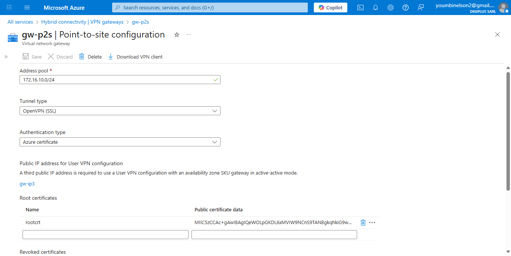
> **Figure 6.1 – Paramètres de la passerelle VPN avec la configuration Point-to-Site activée.**

## 📦 Téléchargement et importation du profil VPN

Une fois la passerelle prête et les certificats configurés, un **package de configuration P2S** est généré depuis Azure. Ce package inclut :

- le fichier `.ovpn` (profil OpenVPN),
- les certificats nécessaires,
- les paramètres IP et DNS.

Le fichier `.ovpn` est ensuite **importé dans le client OpenVPN Connect** sur la machine Windows ou Linux.

## 🖥️ Interface OpenVPN Connect

L’application **OpenVPN Connect** permet de gérer la connexion de manière simple, avec un accès aux logs, à l'état de la connexion, et aux adresses IP utilisées.

> **Figure 6.2 – Interface de OpenVPN Connect montrant une connexion active au réseau Azure.**
> 
## 🔌 Connexion via le client OpenVPN

Le profil est importé, puis la connexion est lancée depuis l'interface graphique d’OpenVPN. La connexion est établie rapidement, et une **adresse IP du pool VPN** est attribuée automatiquement (`172.16.10.x`).

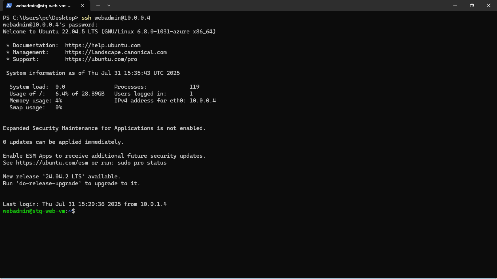
> **Figure 6.3 – Connexion réussie via VPN Point-to-Site sur un poste Windows avec OpenVPN.**

## ✅ Résultat obtenu

Une fois connecté via le VPN :

- Le poste client peut accéder aux VM internes,
- Aucune exposition publique des VM n’est nécessaire,
- La connexion est sécurisée, chiffrée, et limitée aux utilisateurs disposant du bon certificat.
